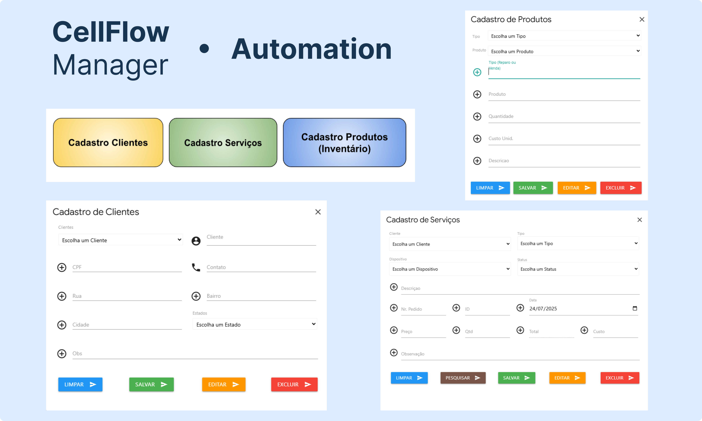
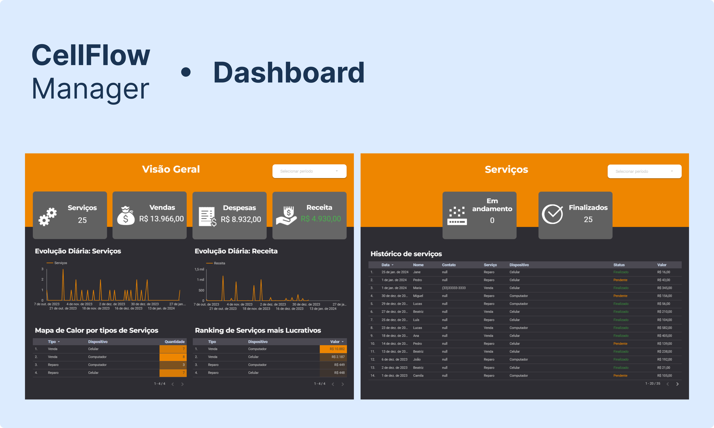

# 📱 CellFlow Manager  
**Automação Comercial & Dashboard para Assistência Técnica de Celulares**  

O **CellFlow Manager** é um projeto de automação integrado ao **Google Sheets** e **Looker Studio**, desenvolvido para otimizar a gestão de **clientes, serviços e inventário** em assistências técnicas de celulares. Com formulários dinâmicos, relatórios estratégicos e controle em tempo real, ele ajuda gestores a tomar decisões baseadas em dados.  

---

## 🔧 Funcionalidades  

### 📂 Automação no Google Sheets  
✔ **Cadastro de Clientes** (Nome, contato, histórico de serviços)  
✔ **Cadastro de Serviços** (Tipo de reparo, dispositivo, valor, status)  
✔ **Controle de Inventário** (Peças, estoque, custos, vendas)  
✔ **Edição Direta** (Dados podem ser alterados tanto pelos formulários quanto na planilha)  
✔ **Interface Amigável** (CSS personalizado + JavaScript para interatividade)  

### 📊 Dashboard no Looker Studio  
✅ **Visão Geral Comercial** (Receitas, despesas, serviços concluídos)  
✅ **Mapa de Calor por Serviço** (Reparos vs. Vendas, tipos de dispositivos)  
✅ **Ranking de Serviços Lucrativos** (Quais mais geram receita)  
✅ **Evolução Diária** (Gráficos de serviços e faturamento)  
✅ **Filtros por Período** (Análise personalizada por data)  
✅ **Visão Detalhada** (Abas específicas para serviços e inventário)  

---

## 🖥️ Preview  

### 1️⃣ Automação - Formulários no Google Sheets  
  
*(Interface com botões para cadastro de clientes, serviços e produtos)*  

### 2️⃣ Dashboard - Visão Estratégica  
  
*(Painel com gráficos, métricas e filtros de período)*  

---

## ⚙️ Tecnologias Utilizadas  
- **Google Apps Script** (JavaScript para automação)  
- **HTML/CSS** (Design dos formulários)  
- **Google Sheets API** (Armazenamento e gestão de dados)  
- **Looker Studio** (Dashboard e business intelligence)  

---

<!-- ## 🚀 Como Usar?  
1. **Acesse a Planilha** (Integrada com os formulários)  
2. **Cadastre clientes, serviços e produtos** via botões automatizados  
3. **Consulte e edite dados** diretamente na planilha  
4. **Acesse o Dashboard** para análises em tempo real  

--- -->

## 📄 Licença  
Projeto livre para uso e adaptação, desde que citada a autoria.  

---  
✨ **Feito para transformar a gestão de assistências técnicas!** ✨  